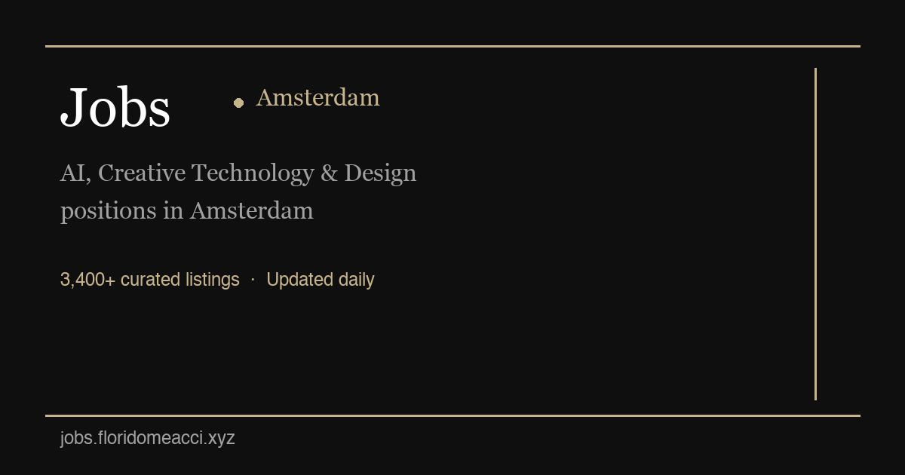

# Colino — the job colander

> Strain out the noise. Find the jobs that fit.

**Colino** is an agent-native job search that filters live openings across every sector down to the roles that actually match your CV. Upload your resume (or just describe what you're after) and an AI agent reads your skills, roles, seniority, location, and industry — then ranks the jobs that fit, suggests companies to explore next, and learns from every like and dislike you give it.

Built for the **[WebMCP Challenge](https://devpost.com)** — a web app that gets meaningfully better when people and their agents use it together.



---

## What it does

- **Resume → matches.** Drop a PDF resume; the agent extracts skills, current roles, future/growth roles, seniority, industry, and location, then ranks the live job feed by fit.
- **Conversational agent.** A left-hand chat panel lets you refine in plain language — "senior design roles in the Netherlands" — while results update live on the right.
- **Semantic search tags.** Search terms become removable tags; the feed re-ranks by semantic relevance instead of hard-filtering, so "creative technologist" surfaces related roles, not just exact title matches.
- **Like / dislike learning.** Vote jobs up or down and the ranking learns — liked jobs and their companies float up, disliked ones sink. AI-suggested matches are auto-liked so the search keeps leaning the right way.
- **Live company discovery.** When results are thin, the agent proposes ~100 real companies for your query and fetches their live postings from Greenhouse, Lever, Ashby, Workable, and Recruitee.
- **WebMCP tools.** Exposes the platform to browser agents via `document.modelContext.registerTool(...)`: `search_jobs`, `get_job_details`, `get_companies`, `get_stats`, `propose_companies`.

## Try it live

**https://colino.work**

Test it in ChatGPT's in-app browser or Google Chrome with `chrome://flags/#enable-webmcp-testing` enabled.

## How it works

```
┌─────────────┐     ┌──────────────────────────────┐     ┌──────────────────┐
│  Frontend   │────▶│  Cloudflare Worker (single)  │────▶│  KV (job store)  │
│  static SPA │     │  • AI chat + matching        │     │  • cached jobs   │
│  + WebMCP   │◀────│  • ATS collectors            │     │  • embeddings    │
└─────────────┘     │  • semantic ranking          │     └──────────────────┘
                    └──────────────────────────────┘
```

- **Matching** — CV/profile text is embedded with `bge-small-en-v1.5` (Cloudflare Workers AI) and ranked against job embeddings (cosine similarity + keyword + seniority + recency).
- **Conversation** — the chat agent gets a full platform overview (top companies, titles, locations, seniority) so it genuinely understands the catalogue.
- **Company discovery** — the agent names employers for a query, then scrapes their live ATS boards; results are cached in KV with 30-day retention.
- **Safety** — no secrets ever reach the client or agents; rate limiting on stateful endpoints; input validation, prompt-injection guards, and security headers throughout.

## Tech stack

| Layer | Tech |
|---|---|
| Runtime | Cloudflare Workers |
| Storage | Cloudflare KV |
| Embeddings | Cloudflare Workers AI (`bge-small-en-v1.5`) |
| LLM | Replicate (`deepseek-v3`) |
| Frontend | Vanilla JS + CSS (no framework) |
| PDF | pdf.js |
| Agents | WebMCP (W3C spec) |

## Getting started

### Prerequisites

- Node.js 18+
- A Cloudflare account with `wrangler` (`npm i -g wrangler`)
- A [Replicate](https://replicate.com) API key (for CV analysis + chat)

### Install & run locally

```bash
npm install
cp .env.example .env   # add your REPLICATE_API_KEY
npm run dev            # http://localhost:8787
```

### Deploy

```bash
npx wrangler login
npx wrangler kv namespace create JOBS_KV   # update the id in wrangler.toml
npx wrangler secret put REPLICATE_API_KEY
npx wrangler deploy
```

### Env vars

| Var | Where | Purpose |
|---|---|---|
| `REPLICATE_API_KEY` | `.env` (local) / `wrangler secret` (prod) | CV analysis + chat LLM |

**Never commit credentials.** `.env` and `.dev.vars` are gitignored.

## Project structure

```
src/worker.js        # single Worker: API routes, AI matching, ATS collectors
public/              # static SPA (index.html, app.js, style.css, webmcp.js)
collectors/          # offline ATS collector scripts (Greenhouse, Lever, Ashby, …)
data/                # seed job data
wrangler.toml        # Worker + KV + AI binding config
```

## License

[MIT](./LICENSE) © 2026 Florido Meacci
